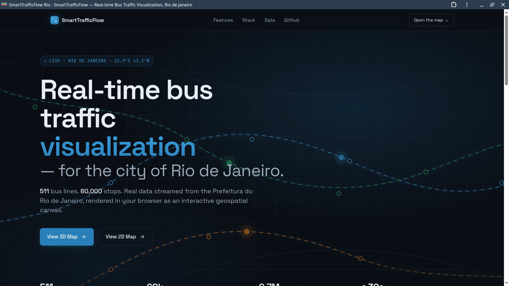
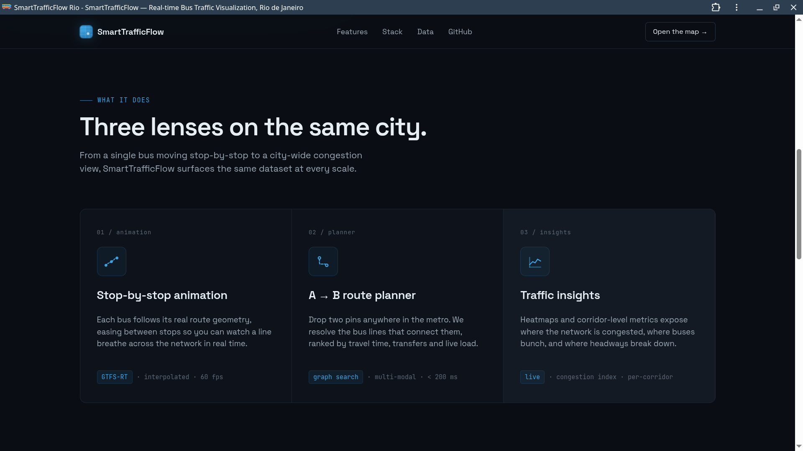
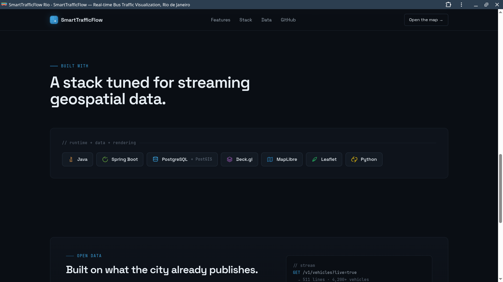

# SmartTrafficFlow — Rio de Janeiro Bus Traffic Visualization

A full-stack geospatial web application for visualizing and simulating real-time bus traffic across Rio de Janeiro's 511 bus lines. Built with Java/Spring Boot, PostgreSQL, Deck.gl, MapLibre GL, and Leaflet.

---

## Live Demo

**Landing:** https://smarttrafficflow-production.up.railway.app

**3D Map:** https://smarttrafficflow-production.up.railway.app/index-3d.html

**2D Map:** https://smarttrafficflow-production.up.railway.app/index-2d.html

---

## Screenshots


*Landing page — project overview with links to both map views*


*Features section — stop-by-stop animation, route planner and traffic insights*


*Tech stack section — built with Java, Spring Boot, PostgreSQL, Deck.gl, MapLibre, Leaflet and Python*

---

## Features

- **3D and 2D map views** — MapLibre GL + Deck.gl (3D) and Leaflet (2D)
- **Stop-by-stop bus animation** — buses follow real route paths with pauses at each stop
- **Camera follow** — map tracks the bus, releases on manual drag
- **Route planner (A to B)** — find viable bus lines between two points via text search or map click
- **Traffic insights panel** — real-time level distribution and most congested lines
- **Consortium and line filters** — filter by operator (Internorte, Intersul, Transcarioca, Santa Cruz, MobiRio)
- **Dark mode** — both maps support light/dark tile switching
- **Right-side stop placement** — geometric cross-product filter ensures stops are on the correct boarding side
- **Mobile support** — responsive layout, touch gestures, follow bus button

---

## Tech Stack

| Layer | Technology |
|---|---|
| Backend | Java 21, Spring Boot 3.5, PostgreSQL 15, Flyway |
| Frontend 3D | MapLibre GL, Deck.gl 8.9, JavaScript ES Modules |
| Frontend 2D | Leaflet 1.9, JavaScript ES Modules |
| Data Pipeline | Python 3.11, GeoPandas, Shapely, NumPy |
| Geocoding | Nominatim (OpenStreetMap) |
| Deploy | Docker, Railway |

---

## Architecture

```
┌─────────────────────────────────────────────────────┐
│                   Spring Boot Backend               │
│                                                     │
│  TrafficService      ← routes + traffic levels      │
│  LineStopsService    ← 511 lines cached in memory   │
│  RouteFinderService  ← Haversine A→B route search   │
│                                                     │
│  PostgreSQL ← enriched traffic dataset              │
│  GeoJSON    ← route geometries + stop locations     │
└──────────────────────┬──────────────────────────────┘
                       │ REST API
        ┌──────────────┴──────────────┐
        │                             │
   3D Map (MapLibre + Deck.gl)   2D Map (Leaflet)
   main.js                       main-2d.js
   route-planner-3d.js           route-planner-2d.js
```

---

## Data Pipeline

The dataset was built from official Rio de Janeiro open data:

```
Base datasets (data/clean/):
  Rotas_Regulares_CLEAN.geojson    ← 989 route geometries with service IDs
  Pontos_Paradas_CLEAN.geojson     ← 7,679 bus stop locations
  Logradouros_CLEAN.geojson        ← 242MB street network (speed limits, neighbourhoods)

scripts/generate_lines_stops_vfinal.py
  ├── Symmetric 15m buffer → candidate stop-route pairs (90,450 found)
  ├── Cross-product right-side filter → 30.4% left-side stops removed
  ├── Cross-line contamination removal → 2,972 duplicates removed
  └── Path-ordered stops → lines_with_stops_vfinal.json (~60,000 stops)

scripts/generate_dataset.py
  ├── Uses all 3 base datasets
  ├── Infers neighbourhood from street name matching (Logradouros)
  ├── Assigns traffic levels based on speed + volume simulation
  └── Enriched CSV → imported to PostgreSQL via /api/traffic/import
```

**Output:** 511 lines (57 circular, 454 two-way), ~60,000 stops

---

## Technical Decisions

**Why two maps?**
The 3D map with Deck.gl offers a more immersive visualization with tilt and perspective. The 2D map with Leaflet is lighter and more accessible on mobile devices. Both share the same backend and business logic.

**Why the right-side filter?**
In Brazil traffic flows on the right. Without the filter, stops on the opposite side of the street were included in the dataset, causing the bus to stop on the wrong side. The cross-product between the route direction vector and the stop vector determines the correct side.

**Why in-memory cache for stops?**
The lines_with_stops_vfinal.json file contains ~60,000 stops. Loading it into memory at startup via @PostConstruct eliminates per-request I/O latency and allows O(1) lookup by line.

**Why migrate routes from GeoJSON to PostgreSQL?**
The original GeoJSON file was 32MB. Serving it on every request was unfeasible in production. Migrating to a PostgreSQL routes table with a Flyway migration reduced response time and enabled the deploy on Railway.

---

## Getting Started

### Prerequisites

- Java 21+
- Maven 3.9+
- PostgreSQL 15+
- Python 3.11+ with GeoPandas, Shapely, NumPy

### 1. Clone the repository

```bash
git clone https://github.com/MatheusNRusso/smarttrafficflow.git
cd smarttrafficflow
```

### 2. Configure local properties

Create `backend/traffic-insight/src/main/resources/application-local.yaml` (not committed):

```yaml
spring:
  datasource:
    url: jdbc:postgresql://localhost:5432/your_db_name
    username: your_db_user
    password: your_db_password

traffic:
  geojson:
    routes: /path/to/Rotas_Regulares_CLEAN.geojson
    stops:  /path/to/Pontos_Paradas_CLEAN.geojson
```

### 3. Generate the stops dataset

```bash
cd scripts/
python generate_lines_stops_vfinal.py \
  --routes /path/to/Rotas_Regulares_CLEAN.geojson \
  --stops  /path/to/Pontos_Paradas_CLEAN.geojson \
  --output ../backend/traffic-insight/src/main/resources/data/lines_with_stops_vfinal.json
```

### 4. Run the backend

```bash
cd backend/traffic-insight
mvn spring-boot:run -Dspring-boot.run.profiles=local
```

### 5. Access the application

| Map | URL |
|---|---|
| 3D (MapLibre + Deck.gl) | http://localhost:8080 |
| 2D (Leaflet) | http://localhost:8080/index-2d.html |

---

## API Endpoints

| Method | Endpoint | Description |
|---|---|---|
| GET | `/api/traffic/routes` | All route geometries (GeoJSON) |
| GET | `/api/traffic/status-by-hour?hour=8` | Traffic levels by hour |
| GET | `/api/traffic/stops-by-line?line=232&direction=0` | Ordered stops for a line/direction |
| GET | `/api/traffic/routes/between?latA=&lngA=&latB=&lngB=` | Route planner A to B |
| GET | `/api/traffic/routes/nearby?lat=&lng=&radius=500` | Lines near a point |
| GET | `/api/traffic/summary/levels` | Traffic level distribution |

---

## Project Structure

```
traffic-insight/
├── backend/
│   └── traffic-insight/
│       ├── src/main/java/          ← Spring Boot application
│       │   └── .../
│       │       ├── controller/     ← REST controllers
│       │       ├── service/        ← Business logic
│       │       ├── dto/            ← Data Transfer Objects
│       │       ├── model/          ← JPA entities
│       │       └── repository/     ← Spring Data repositories
│       └── src/main/resources/
│           ├── static/             ← Frontend (HTML, CSS, JS)
│           │   ├── js/3d/          ← 3D map modules
│           │   ├── js/2d/          ← 2D map modules
│           │   └── js/core/        ← Shared modules
│           └── db/migration/       ← Flyway SQL migrations
├── docs/                           ← Screenshots
└── scripts/                        ← Python data pipeline
    ├── generate_lines_stops_vfinal.py
    └── generate_dataset.py
```

---

## License

MIT
